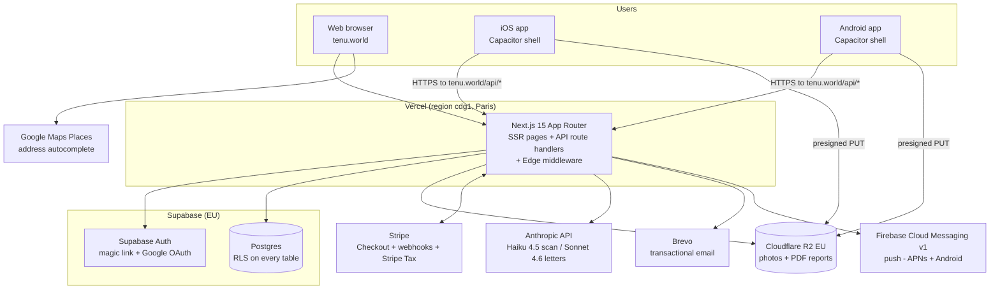

# 01 — Architecture Overview

Status: verified against `main` @ `2697e1e` (2026-06-10).
Scope: system context, component map, environments, deployment topology.
Everything below is grounded in the code as it exists on `main`. Where older project docs (CLAUDE.md, early specs) diverge from the code, the code wins and the divergence is noted.

---

## 1. System context

Tenu is a multilingual tenant-rights companion for France (UK code paths exist but the jurisdiction is disabled at launch). The product produces evidence-grade move-in/move-out inspection records, an AI deposit-risk scan, and an AI-drafted dispute letter, sold per inspection through Stripe Checkout.

External parties that consume Tenu output (mediators, landlords, the Commission Départementale de Conciliation) receive PDF reports and letters; they never touch the system directly.

## 2. Component map

| Component | Technology | Where in repo | Role |
|---|---|---|---|
| Web app | Next.js 15 (App Router), React 19, TypeScript strict, Tailwind 4 | `src/app/`, `src/components/` | All pages, SSR + client components |
| API layer | Next.js route handlers | `src/app/api/` | Auth-gated JSON endpoints; the only place secrets are used |
| Edge middleware | `src/middleware.ts` | — | Supabase session check + public-path allow-list redirect to `/auth/login` |
| Auth | Supabase Auth (`@supabase/ssr`) | `src/lib/supabase/{server,client,admin}.ts` | Magic link (OTP) + PKCE/OAuth; cookie sessions on web, bearer tokens from mobile |
| Database | Supabase Postgres, RLS everywhere | `supabase/schema.sql`, `supabase/migrations/001–007` | profiles, inspections, rooms, photos, element_ratings, tenants, dispute_letters, outcome_surveys, payments, consents, device_tokens |
| Object storage | Cloudflare R2 (EU), S3-compatible API | `src/lib/storage/r2-upload.ts`, `src/app/api/mobile/upload-{intent,commit}/` | Photos (user/room namespaced keys) and rendered PDF reports |
| Payments | Stripe Checkout (dynamic line items), Stripe webhooks, optional Stripe Tax | `src/lib/payments/stripe.ts`, `src/app/api/checkout/`, `src/app/api/webhooks/stripe/` | 5-tier pricing grid, dispute add-on, exit-only SKU |
| AI | Anthropic SDK `@anthropic-ai/sdk`, server-only | `src/lib/ai/risk-scan.ts`, `src/lib/ai/dispute-letter.ts` + prompt/type modules | Haiku 4.5 risk scan (Sonnet 4.6 fallback), Sonnet 4.6 dispute letter |
| PDF | `@react-pdf/renderer`, server-only | `src/lib/pdf/` | Scan report rendered in-process, uploaded to R2 |
| Email | Brevo REST (no SDK) | `src/lib/email/` | scan-complete and dispute-ready transactional emails |
| Push | FCM v1, hand-rolled JWT signing (no firebase-admin) | `src/lib/notifications/push.ts` | No-op until `FCM_*` env vars set |
| Mobile shells | Capacitor 7, iOS + Android native projects | `capacitor.config.ts`, `ios/`, `android/`, `src/app/(mobile)/`, `src/lib/mobile/` | Thin wrapper over a static export (`out/`); offline drafts in SQLite, upload queue, deep links |
| i18n | Custom, in-repo (`src/lib/i18n/config.ts`) + per-page `COPY` dictionaries | — | 10 locales declared; FR default; RTL for AR/UR; legal copy FR/EN only |
| Brand/design | Locked token system | `src/app/theme.css`, `docs/brand/BRAND-GUIDELINES.md`, `src/components/brand/TenuMark.tsx` | See `03-Design-System.md` |

**Divergence note (i18n):** older docs state "next-intl, route-based locale (`src/app/[locale]/`)". The code has neither — `next-intl` is not in `package.json`, there is no `[locale]` route segment, and there is no `src/messages/` directory. Localisation is done with a locale config module, per-page FR/EN copy dictionaries, and an on-demand machine-translation preview widget (`src/components/web/TranslatePreview.tsx`) for the other locales.

## 3. Web vs mobile build modes

`next.config.ts` is dual-mode:

- `npm run build` — full SSR build with API routes and Server Actions, deployed to Vercel.
- `npm run build:mobile` (`MOBILE_BUILD=1`) — `output: "export"` static export to `out/`, consumed by Capacitor (`webDir: "out"`). API routes and Server Actions are **not** in the mobile bundle; the native apps call `https://tenu.world/api/*` over HTTPS. A webpack alias swaps `@/app/actions/auth` for a stub (`src/lib/mobile/stubs/auth-actions.ts`) and `scripts/build-mobile.sh` stashes web-only route trees before exporting.

The Capacitor shell (`capacitor.config.ts`, appId `world.tenu.app`):
- `allowNavigation` restricted to `tenu.world` / `*.tenu.world`; iOS `limitsNavigationsToAppBoundDomains: true`.
- No secrets or AI keys ship on-device.
- Stripe Checkout opens in SFSafariViewController / Chrome Custom Tab via `@capacitor/browser`; return is intercepted by Universal Links / App Links (`src/app/.well-known/` route handlers serve `apple-app-site-association` and `assetlinks.json`).
- Offline-first inspection drafts via `@capacitor-community/sqlite` (`src/lib/mobile/storage/`), drained by a sync engine (`src/lib/mobile/sync/syncEngine.ts`) using the presigned-upload API pair.

## 4. Environments and deployment topology

| Environment | Host | Notes |
|---|---|---|
| Production web | Vercel, project pinned to region `cdg1` (Paris) via `vercel.json` | Auto-deploy on push to `main`; `tenu.world` DNS on Vercel |
| Preview | Vercel preview deployments per branch | Same env-var set minus production keys |
| Local | `next dev --turbopack` | `.env.local` from `.env.local.template` |
| Mobile dev | `CAP_SERVER_URL=http://<lan-ip>:3000` before `cap sync` | Cleartext allowed only when that var is set |
| Mobile release | Static export baked into the shell | App Store / Play Store, Reader-App model (payment on web, no IAP) |

Security headers for `/api/*` (`X-Content-Type-Options: nosniff`, `X-Frame-Options: DENY`) are set in `vercel.json`.

Data residency: Supabase EU, R2 EU jurisdiction, Vercel CDG. The one non-EU-guaranteed leg is the Anthropic API (see §5).

## 5. Pending change — AWS Bedrock EU migration (flag)

Branch `feat/bedrock-migration` (see `docs/15-Bedrock-Migration.md` on that branch) replaces the direct Anthropic API in `src/lib/ai/risk-scan.ts` and `src/lib/ai/dispute-letter.ts` with AWS Bedrock Frankfurt (`eu-central-1`) inference profiles (`eu.anthropic.claude-haiku-4-5-…`, `eu.anthropic.claude-sonnet-4-6-…`), with a guard that refuses to boot unless `AWS_REGION` starts with `eu-`. Rationale: the privacy policy promises EU data residency, which the direct pay-as-you-go Anthropic API does not contractually guarantee. **This document describes `main`, which still calls `api.anthropic.com` with `ANTHROPIC_API_KEY`.** Once the branch merges and AWS account setup completes, sections 2 and 4 here, plus `04-Security.md` §6 and `07-LLD.md` §3, must be updated.

## 6. Document set

See `README.md` in this directory for the index of the architecture documentation set (01–07).
