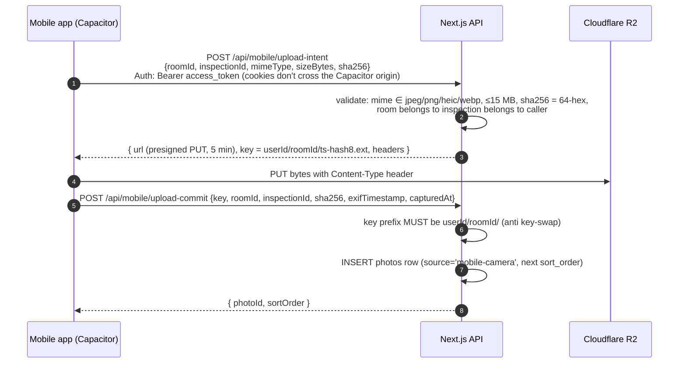
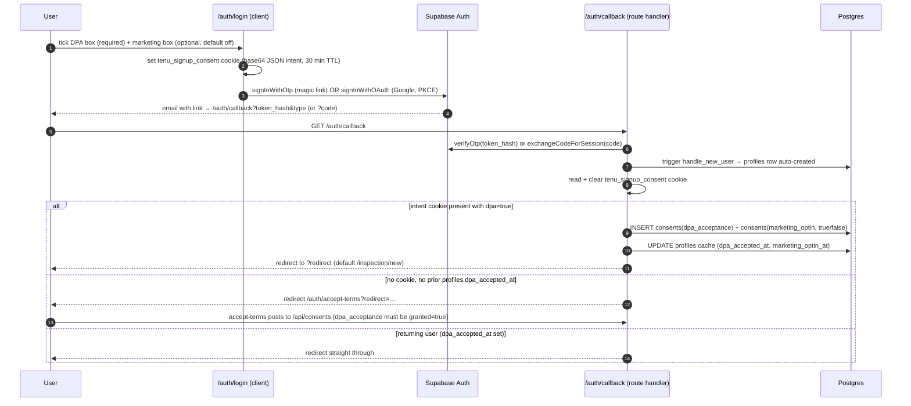

# 02 — Data Flows

Status: verified against `main` @ `2697e1e` (2026-06-10).
Scope: payment → scan → PDF → email pipeline, dispute-letter pipeline, 14-day follow-up status, photo upload flows (web Server Action + mobile presigned PUT), auth flow (magic link, accept-terms, consents).

All flows below are read directly from the route handlers and libraries on `main`. Where the implementation differs from the original pipeline spec ("Stripe webhook → AI → PDF → email" fully webhook-driven), the actual trigger chain is documented and the difference is called out.

---

## 1. Pipeline 1 — payment, risk scan, PDF, email

**Reality check:** the Stripe webhook does *not* trigger the AI pipeline directly. The webhook records the payment and flips inspection state; the scan itself is triggered by an authenticated client call to `POST /api/ai/scan` (web report page `triggerScan()`, or mobile `SubmitFlow`). The scan handler then runs AI → PDF → email synchronously in one request.

```mermaid
sequenceDiagram
    autonumber
    participant U as User (web/mobile)
    participant API as Next.js API (Vercel)
    participant DB as Supabase Postgres
    participant ST as Stripe
    participant AN as Anthropic API
    participant R2 as Cloudflare R2
    participant BR as Brevo

    U->>API: POST /api/checkout {product, inspectionId, waiverConsent}
    API->>DB: verify inspection ownership + rooms
    API->>DB: INSERT consents (withdrawal_waiver_l221_28, IP, UA)
    API->>ST: checkout.sessions.create (tier-priced line items,<br/>metadata: inspectionId, userId, product, waiverConsentId)
    ST-->>U: hosted Checkout page
    U->>ST: pays
    ST->>API: POST /api/webhooks/stripe (checkout.session.completed)
    API->>API: verify signature (STRIPE_WEBHOOK_SECRET)
    API->>DB: INSERT payments (admin client, bypasses RLS,<br/>incl. tax_amount_cents / tax_rate_bps / tax_country, waiver_consent_id)
    API->>DB: UPDATE inspections SET status='paid' (report / exit_only)
    ST-->>U: redirect to /inspection/[id]/payment-return
    Note over U: payment-return does NOT trust the URL param —<br/>it re-reads inspection status from Supabase

    U->>API: POST /api/ai/scan {inspectionId, tenantNotes?}
    API->>DB: verify owner, require status='submitted', fetch rooms + photo r2_urls
    API->>AN: messages.create (Haiku 4.5; retry; Sonnet 4.6 fallback;<br/>images by URL, JSON-only output)
    AN-->>API: RiskScanOutputV2 (Zod-validated, meta server-forced)
    API->>DB: UPDATE rooms (risk_level, risk_score, risk_notes, estimated_deduction_eur)
    API->>R2: PUT rendered PDF (@react-pdf/renderer, best-effort)
    API->>DB: UPDATE inspections SET status='scanned', risk_score = {v2, pdfUrl, telemetry}
    API->>BR: scan-complete email (best-effort) + FCM push (no-op without env)
    API-->>U: { scanResult, status: 'scanned', pdfUrl }
```

Guardrails inside the scan leg (`src/lib/ai/risk-scan.ts`):
- Minimum 3 photos across rooms, else `INSUFFICIENT_PHOTOS` (400).
- Attempt ladder: Haiku → Haiku retry → Sonnet fallback; cumulative cost cap €0.12/scan (`BUDGET_EXCEEDED` → 402).
- Model output is Zod-validated; `meta.model`, `meta.generated_at`, `meta.grille_version`, `inspection_id` are overwritten server-side so the model cannot forge them.
- PDF render/upload and the Brevo email are best-effort: failures are logged, never surfaced as 5xx, because the scan result is already persisted.

**Known state-machine wrinkle (documented, not fixed here):** `POST /api/ai/scan` requires `status === 'submitted'` and has **no payment check**, while the webhook sets `status = 'paid'`. As written, an owner can scan a submitted inspection without paying, and a paid inspection (`status='paid'`) would be rejected by the scan endpoint. See the findings list in `04-Security.md` §8.

## 2. Pipeline 2 — dispute letter

Sold post-verdict only (`product: "dispute"`). Three gates fire before generation:

1. **Eligibility gate** (`src/lib/ai/dispute-eligibility.ts`, also served by `GET /api/dispute/eligibility`): refuses when there is no v2 scan, when `meta.quality_flag = 'insufficient_evidence'`, or when `refundable_eur <= 0` with a known deposit. Enforced again server-side in `/api/checkout` so a crafted POST cannot bypass the UI.
2. **Waiver gate**: both L221-28 1° checkboxes must validate server-side before the Stripe session is created.
3. **Paid gate**: the Stripe webhook pre-inserts a `dispute_letters` row with `stripe_payment_id` set (idempotent on retries) and flips `inspections.dispute_purchased = true`. `POST /api/ai/dispute` returns 402 unless that row exists (or `DISPUTE_PAYMENT_GATE_BYPASS=1`, a dev escape hatch).

```mermaid
sequenceDiagram
    autonumber
    participant U as User
    participant API as Next.js API
    participant DB as Supabase
    participant ST as Stripe
    participant AN as Anthropic (Sonnet 4.6)
    participant BR as Brevo

    U->>API: POST /api/checkout {product:'dispute', waiverConsent}
    API->>API: evaluateDisputeEligibility(risk_score) — reject if ineligible
    API->>DB: INSERT consents (waiver) → Stripe session
    U->>ST: pays €20
    ST->>API: webhook → INSERT dispute_letters {status:'pending', stripe_payment_id}<br/>+ UPDATE inspections.dispute_purchased=true
    U->>API: POST /api/ai/dispute {inspectionId, tone?, recipient?, tenantRationale?}
    API->>DB: require status='scanned' + paid dispute_letters row + risk_score.v2
    API->>API: sanitise tenantRationale (strip <>, cap 500 chars — injection guard)
    API->>AN: Sonnet → Sonnet retry; Zod schema; items-sum check (±1 EUR);<br/>cost cap €0.50/letter
    AN-->>API: DisputeLetterOutput (header/body/items_table/closing/disclaimer)
    API->>DB: UPDATE dispute_letters SET status='generated', letter_content, deduction_items…
    API->>BR: dispute-ready email (best-effort) + push
    API-->>U: { disputeId, letter, costEur, modelUsed }
```

Letter type is derived from the recipient role: `CDC` / `TDS` / `DPS` / `LANDLORD`. Letter locale is FR or EN only. **The dispute-letter PDF leg is not implemented on `main`** — `letter_content` is plain text rendered on the report page; `dispute_letters.letter_pdf_url` stays null and the email links to the report page (the `notify.ts` comment marks the PDF leg as future work).

## 3. Pipeline 3 — 14-day outcome follow-up

**Status: not implemented.** The data model exists (`outcome_surveys` table in `supabase/schema.sql` with RLS select/update policies; an earlier `outcomes` table in `migrations/001`), and marketing/feature pages describe the flow, but there is:
- no Supabase scheduled function or edge function in `supabase/`,
- no cron entry in `vercel.json`,
- no code path in `src/` that writes `survey_sent_at` or sends a Brevo survey.

Any statement that pipeline 3 is live is aspirational. It is launch-deferred work, not a code fact.

## 4. Photo upload flows

Two distinct paths exist.

### 4.1 Web — Server Action direct upload

`src/lib/storage/r2-upload.ts` (`"use server"`): browser posts `FormData` to the `uploadPhotoToR2` Server Action; the server buffers the file (Server Action body limit 10 MB per `next.config.ts`), computes SHA-256, best-effort parses EXIF `DateTimeOriginal` (`exifr`), and PUTs to R2 with the hash stored as object metadata. The client then persists the metadata row via `POST /api/photos` (room ownership re-verified; `sha256Hash` mandatory). Key shape: `{userId}/{roomId}/{timestamp}.{ext}`. Geolocation of individual photos is deliberately not captured (GDPR minimisation) — the inspection address anchors location.

### 4.2 Mobile — presigned PUT (intent / commit)

Binary bytes never transit Vercel.



Accepted-risk note from the code: the commit endpoint does **not** re-read the R2 object to verify the claimed sha256; a weekly verification sweep is described in comments but does not exist yet.

The mobile sync engine (`src/lib/mobile/sync/syncEngine.ts`) drains an offline SQLite upload queue through this pair once the draft has been materialised server-side via `/api/inspection/create` (triggered from the Review & Send step, not the engine).

## 5. Auth flow — magic link, OAuth, accept-terms, consents gate



Key properties, straight from the code:
- Magic link only — no password flow exists anywhere (the Supabase "leaked password protection" lint is deliberately ignored in `migrations/007` for this reason).
- The consent intent travels in a non-httpOnly cookie because the OAuth/magic-link redirect loses page state; `/auth/callback` is the single drain point and clears the cookie on every branch.
- `consents` is append-only (no UPDATE/DELETE policies); every row stores `text_version`, locale, IP, user-agent. The `profiles` columns are an explicitly documented cache, never the source of truth (`migrations/005`).
- Cross-device fallback: if the magic link is opened on a device without the cookie, `/auth/accept-terms` is the defensive DPA gate. It is a client page; promoting the gate into middleware is tracked as open hardening work (TASKS p:1), so today an authenticated user without DPA acceptance is only gated by UI flow, not by the edge.
- Middleware (`src/middleware.ts`) redirects unauthenticated users to `/auth/login?redirect=…` for any path outside the public allow-list (see `04-Security.md` §2).
- Sign-out is a Server Action (`src/app/actions/auth.ts`), CSRF-safe by construction; the mobile build aliases it to a stub.

## 6. Account deletion (GDPR Art. 17)

`POST /api/account/delete`: typed-email confirmation must match the session email → session signed out → `auth.admin.deleteUser` via the service-role client → FK `on delete cascade` wipes profiles → inspections → rooms → photos rows, consents, payments, dispute_letters. Note that this deletes **database rows**; R2 blobs are not deleted by this route (no R2 sweep exists on `main` — retention automation is open RGPD work, see `04-Security.md` §7).
