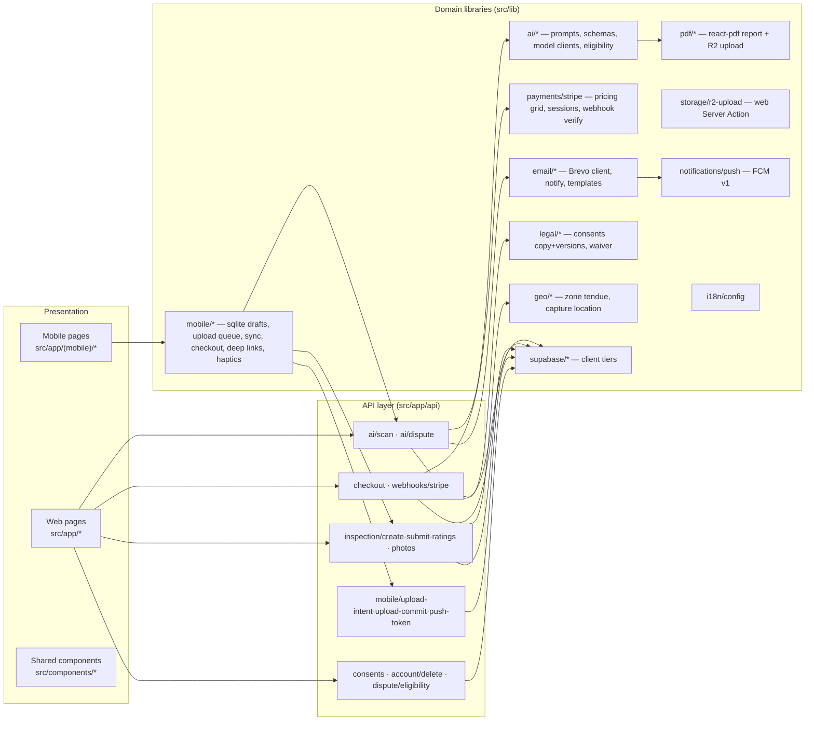
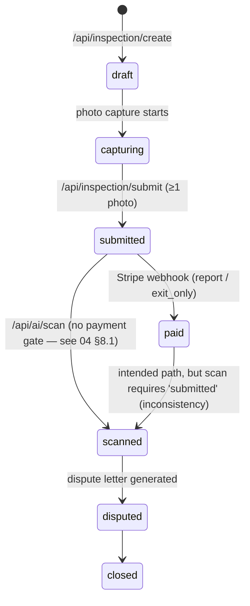

# 05 — High-Level Design

Status: verified against `main` @ `2697e1e` (2026-06-10).
Scope: modules, responsibilities, interfaces, hosting, scaling assumptions, failure modes. Low-level shapes live in `07-LLD.md`.

---

## 1. Module decomposition

### Responsibilities

| Module | Responsibility | Must not |
|---|---|---|
| `src/app/api/*` | AuthN/AuthZ, input validation, orchestration, HTTP mapping of typed errors | contain prompts, pricing constants, or SQL beyond Supabase query builder |
| `src/lib/ai` | Prompt construction, model calls with retry ladder, Zod validation, cost accounting, eligibility policy | be imported by client components (enforced via `server-only`) |
| `src/lib/payments/stripe` | The pricing model (tier detection from pièces principales), Checkout session assembly, webhook signature verification | be called outside route handlers |
| `src/lib/pdf` | Deterministic in-process PDF rendering + R2 persistence | block the scan response on failure (best-effort contract) |
| `src/lib/email` + `notifications` | Transport seam for Brevo and FCM; never throws, returns discriminated results | surface transport failure as user-facing 5xx |
| `src/lib/legal` | Versioned consent copy (FR/EN), waiver payload validation, cookie-pref helpers | be machine-translated or edited without bumping `*_TEXT_VERSION` |
| `src/lib/mobile` | Offline-first draft store (SQLite), upload queue + sync engine, native checkout hand-off, deep-link handling | assume API routes exist in the static bundle |
| `supabase/` | Schema + RLS as the final authorisation layer | be bypassed except via the documented admin-client cases |

## 2. Interfaces

Internal interface style: route handlers speak JSON over HTTPS; domain libraries expose typed functions with discriminated-union results or typed error classes (`ScanError`, `DisputeError`) that handlers map to HTTP codes. Full request/response shapes: `07-LLD.md` §2.

External interfaces:

| Counterparty | Protocol | Direction | Auth |
|---|---|---|---|
| Supabase | postgrest + auth REST via SDKs | out | anon key + user JWT / service-role key |
| Stripe | REST (SDK) + webhook | both | secret key / webhook signing secret |
| Cloudflare R2 | S3 API (PUT/presign) | out + client direct PUT | R2 access keys; presigned URLs for clients |
| Anthropic | Messages API (SDK) | out | `ANTHROPIC_API_KEY` (Bedrock EU pending — see 01 §5) |
| Brevo | REST `POST /v3/smtp/email` | out | API key header |
| FCM v1 | REST + OAuth2 JWT | out | service-account key (optional; no-op without) |
| Google Maps Places | JS API (client) | client-side | `NEXT_PUBLIC_GOOGLE_MAPS_API_KEY` |
| App/Universal Links | `/.well-known/*` route handlers | in | none (public manifests) |

## 3. State machines

Inspection status (column `inspections.status`):

Dispute letter status: `pending` (webhook pre-insert) → `generated` (Sonnet output persisted). Payments: single `completed` insert from the webhook.

## 4. Hosting and runtime topology

- **Vercel**, single region `cdg1`. Pages SSR/ISR; API routes are serverless functions; middleware runs at the edge. No long-running workers, no queues — every pipeline is a synchronous request.
- **Supabase** hosted Postgres + Auth (EU project `dsbzgrjtiklmxjozbdjv` / `tenu-world-eu-central`, eu-central-1 Frankfurt — cutover 2026-06-10; legacy `umvcjasalzcgtfwsjbfw` eu-west-2 abandoned, deletion pending smoke test).
- **R2** single EU bucket; clients PUT directly via presigned URLs (mobile) or via a Server Action (web).
- **Capacitor shells** are static clients; all dynamic behaviour is remote.

## 5. Scaling assumptions

Designed for the soft-launch cohort (target ~50 paying users in July 2026, breakeven ≈ 4 users/month). Consequences visible in the design:

- The scan request does model calls for a whole inspection, PDF render, R2 upload and email **inside one serverless invocation**. Acceptable at this volume; the binding constraints are the Vercel function timeout and Anthropic latency, not throughput.
- Mobile photo bytes bypass Vercel entirely (presigned PUT) — the one deliberate bandwidth-scaling decision. The web upload path still proxies bytes through a Server Action (10 MB body cap).
- Per-room photo reads and sort-order computation are N+1 style queries; fine at this scale.
- Cost ceilings per AI call bound worst-case spend; `SYSTEM_USD_EUR` env pins the FX rate (the ECB FX cron was removed pre-launch).
- No caching layer beyond Next.js defaults; no CDN config beyond Vercel's.

## 6. Failure modes and behaviour

| Failure | Behaviour (as coded) |
|---|---|
| Anthropic error / invalid JSON / schema fail | Retry ladder (primary, retry, fallback model); typed error → 4xx/5xx with code; nothing persisted on total failure |
| Scan cost over €0.12 / letter over €0.50 | `BUDGET_EXCEEDED` → HTTP 402, abort |
| Model refusal | `MODEL_REFUSAL` → 422 (scan) / 502 (letter), no retry |
| PDF render or R2 upload fails post-scan | Logged warning; scan response still 200 with `pdfUrl: null` |
| Brevo / FCM failure | Logged; never blocks the response (`notify` helpers never throw) |
| Stripe webhook DB insert fails | **500 returned deliberately so Stripe retries** (lesson from the silent-consents incident); idempotency for dispute rows via check-then-insert |
| Payment-return lands with spoofed `?status=paid` | Ignored; the page re-reads inspection status from the DB |
| Presigned URL expires (5 min) | Mobile sync engine re-requests an intent; queue persists offline in SQLite |
| Supabase env vars missing | Middleware fails open (no auth gate) — local-bootstrap convenience, see 04 §2 |
| Account deletion: admin delete fails after sign-out | 500 with support contact; session already cleared; loud server log |
| Webhook product values vs scan precondition | See state-machine inconsistency, 04 §8.1 — currently a logic gap, not a crash |

## 7. Observability

Minimal and log-based: `console.error/warn` with bracketed tags (`[stripe-webhook]`, `[scan]`, `[auth/callback]`, `[account-delete]`) feeding Vercel logs. AI telemetry (cost, model used, attempt count) is persisted into `inspections.risk_score.telemetry` and returned in API responses. Brevo tags (`scan-complete`, `dispute-ready`) group sends in the Brevo dashboard. There is no APM, no error tracker (Sentry etc.), and no structured logging on `main`. `docs/14-Launch-Day-Monitoring.md` covers the manual launch-day watch.
