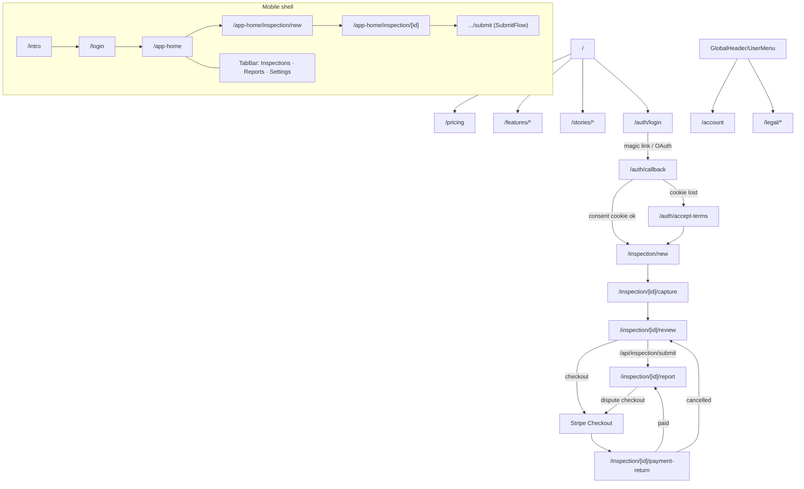

# 06 — Screen Inventory & Wireframes

Status: verified against `main` @ `2697e1e` (2026-06-10).
Scope: every implemented route in `src/app`, with wireframes of the principal screens as actually built (read from the page components, not from design files). The repo has no `[locale]` route segment — locale is resolved per page from a query/toggle with FR fallback.

---

## 1. Route inventory

### 1.1 Public web (SSR tree, deployed to Vercel)

| Route | Type | Content |
|---|---|---|
| `/` | server | Landing: hero (+ JSON-LD Service & FAQ), store badges, trust band, worked example, features band, closing CTA |
| `/pricing` | client | Tier grid (T1–T5/maison), exit-only + dispute cards, live price preview via `GET /api/checkout`, `WithdrawalWaiver` before purchase |
| `/features/{onboarding,evidence,rights,scan,dispute,followup}` | server | One marketing page per product feature |
| `/stories`, `/stories/samir`, `/stories/suzi` | server | Case-study narratives + `OtherCases` cross-links |
| `/legal` | server | Legal hub; `/legal/{terms,privacy,refund,cookies}/{fr,en}` (cookies/fr includes preference resetter) |
| `/auth/login` | client | DPA + marketing checkboxes, Google OAuth, magic-link form |
| `/auth/accept-terms` | client | Defensive DPA gate (cookie-loss fallback) |
| `/auth/callback` | route handler | OTP/PKCE exchange + consent drain (no UI) |
| `/account` | server | Held-data summary, consent history, delete-account (typed-email confirm) |
| `/inspection/new` | client | Full intake form (see wireframe) |
| `/inspection/[id]/capture` | client | Room-by-room photo capture |
| `/inspection/[id]/review` | client | Pre-submit review + submit |
| `/inspection/[id]/report` | client | Scan trigger/results, dispute upsell + letter display |
| `/inspection/[id]/payment-return` | client | Stripe redirect lander (DB-verified, param distrusted) |
| `/robots.txt`, `/sitemap.xml`, `/manifest`, icons, OG image | metadata routes | generated |
| `/.well-known/apple-app-site-association`, `/.well-known/assetlinks.json` | route handlers | Universal/App Links |

### 1.2 Mobile tree `src/app/(mobile)` (static export → Capacitor)

| Route | Content |
|---|---|
| `/intro` | 3-screen scroll-snap onboarding carousel, "Passer" skip, haptics |
| `/login` | Magic-link only; portal mark; DPA/marketing checkboxes; confirmation state replaces form |
| `/app-home` | Home tab: local drafts list + "Nouveau constat" CTA |
| `/app-home/inspection/new` | Minimal draft form (address, type entrée/sortie, rooms) — saved to SQLite for offline capture |
| `/app-home/inspection/[id]` | Draft view (rooms, photos, progress) |
| `/app-home/inspection/[id]/submit` | `SubmitFlow`: materialise → upload queue drain → submit → scan |
| `/app-home/reports` | Stub (full reports list deferred) |
| `/app-home/settings` | Platform info, legal links, sign-out (account mgmt deferred) |

## 2. Navigation map



## 3. Wireframes (as implemented)

### 3.1 Landing `/`

```
┌──────────────────────────────────────────────┐
│ GlobalHeader  [tenu◯]      lang ▾  [Login]   │
├──────────────────────────────────────────────┤
│            t-section-canvas (hero)           │
│        H1 t-display  (tagline copy)          │
│        sub copy · [Primary CTA pill]         │
│      [App Store badge] [Play badge]          │
├──────────────────────────────────────────────┤
│ t-section-band — trust heading + 3 columns   │
├──────────────────────────────────────────────┤
│ t-section-canvas — #example worked example   │
│  H2 + explanatory copy + example artefact    │
├──────────────────────────────────────────────┤
│ t-section-band — #features grid (6 cards,    │
│  lucide icons, links to /features/*)         │
├──────────────────────────────────────────────┤
│ t-section-canvas — closing H2 + CTA          │
│ Footer: legal links · RCS line · disclaimer  │
└──────────────────────────────────────────────┘
```

### 3.2 Login `/auth/login`

```
┌──────────────────────────────┐
│        tenu mark + H1        │
│  ┌────────────────────────┐  │
│  │ [G] Continue w/ Google │  │   ← primary
│  └────────────────────────┘  │
│  ──────────  ou  ──────────  │
│  Email [____________]        │
│  [Recevoir le lien] (pill)   │
│  ☐ DPA (obligatoire) → /legal│
│  ☐ Marketing (facultatif)    │
└──────────────────────────────┘
   submit blocked until DPA ✓
   success → full-screen "Vérifiez votre e-mail"
```

### 3.3 New inspection `/inspection/new` (multi-section single page)

```
┌ H1 Nouveau constat ───────────────────────────┐
│ § JURIDICTION/TYPE   (fr/uk · entrée/sortie)  │
│ § ADRESSE            AddressAutocomplete      │
│                      (zone tendue auto-badge) │
│ § PROPRIÉTAIRE       individual/company,      │
│                      nom, email, tél, adresse │
│ § LOCATAIRES (1–3)   [+ ajouter un locataire] │
│ § CONTRAT            meublé ☐, dates bail,    │
│                      loyer / charges (cents)  │
│ § CARACTÉRISTIQUES   type, surface m², pièces │
│ § PIÈCES             chips: salon chambre     │
│                      cuisine SdB WC entrée    │
│                      cave parking balcon…     │
│ [Créer le constat]  → POST /api/inspection/   │
│                        create → /capture      │
└───────────────────────────────────────────────┘
```

### 3.4 Capture → Review → Report (ProgressStepper across all three)

```
●───●───○───○   (steps array defined per page)

CAPTURE                       REVIEW
┌───────────────────────┐     ┌───────────────────────┐
│ RoomSelector tabs     │     │ H1 Vérifiez votre     │
│ ┌───────────────────┐ │     │    constat            │
│ │  CameraCapture    │ │     │ per-room summary cards│
│ │  (getUserMedia /  │ │     │ (photo counts, notes) │
│ │   file input)     │ │     │ [WithdrawalWaiver ☐☐] │
│ └───────────────────┘ │     │ [Soumettre] → /api/   │
│ PhotoGrid (thumbs +   │     │  inspection/submit    │
│  delete, sha256 kept) │     │ [Payer] → /api/       │
│ ElementRatingPanel    │     │  checkout → Stripe    │
│  (TB/B/M/MV + note)   │     └───────────────────────┘
└───────────────────────┘

REPORT
┌─────────────────────────────────────┐
│ H1 + status chip                    │
│ [Lancer l'analyse] (triggerScan)    │
│   ↓ scanned                         │
│ per-room risk cards:                │
│   chip clear/attention/high ·       │
│   issues list · est. deduction €    │
│ total + PDF link (if rendered)      │
│ ─────────────────────────────────── │
│ Dispute upsell (eligibility-gated): │
│   ☐☐ waiver → [Acheter la lettre]   │
│   or [Générer la lettre] if paid    │
│ letter_content rendered + print     │
└─────────────────────────────────────┘
```

### 3.5 Account `/account`

```
┌ H1 Mon compte ──────────────────────┐
│ § DONNÉES   email · nom · langue    │
│ § CONSENTEMENTS  latest row per     │
│   type (version + date)            │
│ § ZONE DANGER (t-danger heading)    │
│   type your email [________]        │
│   [Supprimer mon compte]            │
│   → POST /api/account/delete        │
└─────────────────────────────────────┘
```

### 3.6 Mobile home + submit flow

```
/app-home                       /app-home/inspection/[id]/submit
┌──────────────────────┐        ┌──────────────────────────────┐
│ NavBar (paper/ink)   │        │ SubmitFlow stages:           │
│ Drafts (SQLite):     │        │ 1 materialise → /api/        │
│ ┌──────────────────┐ │        │   inspection/create          │
│ │ 12 rue X · 8 ph. │ │        │ 2 uploading → intent/PUT/    │
│ └──────────────────┘ │        │   commit per queued photo    │
│ [Nouveau constat]    │        │ 3 submitting → /api/         │
│  (emerald pill CTA)  │        │   inspection/submit          │
├──────────────────────┤        │ 4 scanning → /api/ai/scan    │
│ ▣ Inspections ▢ Rep. │        │ progress + retry on failure  │
│ ▢ Settings (TabBar)  │        └──────────────────────────────┘
└──────────────────────┘
```

### 3.7 Intro carousel `/intro`

Three full-bleed Paper screens with portal mark, scroll-snap horizontal, page dots driven by IntersectionObserver, "Passer" on screens 1–2, advance CTA with haptic feedback; completion persists a preference flag and routes to `/login`.

## 4. Cross-cutting UI behaviours

- `CookieBanner` mounts in the root layout for all web pages; reject-non-essential default.
- `MobileGate`/`AuthGate` wrap the mobile tree (platform + session checks) since middleware does not exist in the static export.
- `TranslatePreview` in the header offers unofficial machine translation for the eight non-FR/EN locales; legal pages stay FR/EN.
- Payment-return never trusts query params; it polls the DB-set status.
