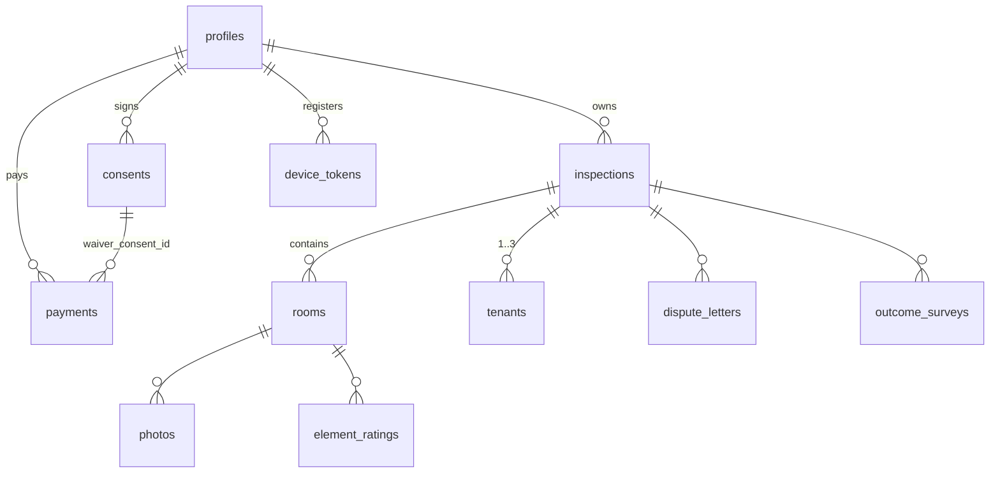

# 07 — Low-Level Design

Status: verified against `main` @ `2697e1e` (2026-06-10).
Scope: key `src/lib` modules, API route contracts, database schema, environment variable inventory.

---

## 1. Key library modules

### 1.1 `src/lib/ai/`

| File | Purpose |
|---|---|
| `risk-scan.ts` | `scanAllRooms(input: ScanInput): Promise<ScanResultV1>` — server-only. Models: primary `claude-haiku-4-5-20251001`, fallback `claude-sonnet-4-6`; max_tokens 2048, temperature 0.2. Attempt ladder primary→retry→fallback. Cost cap €0.12/scan (`SYSTEM_USD_EUR` fallback 0.93). Photos passed as URL image blocks prefixed with `[room_id=…]` text markers. Output Zod-validated (`RiskScanOutputV2Schema`); `meta.model/generated_at/grille_version/prompt_version` and `inspection_id` are server-forced post-parse. Collapses v2 → legacy v1 room shape (riskScore = min(1, subtotal/500); high ≥0.7, medium ≥0.4) for the existing UI. Throws `ScanError` with 7 codes. |
| `risk-scan-prompt.ts` | `buildSystemPrompt()`, `buildUserPrompt()`, `GRILLE_VERSION` — the grille vétusté prompt pack. |
| `dispute-letter.ts` | `generateDisputeLetterV2(input: DisputeLetterInput)` — Sonnet 4.6 only (Sonnet→Sonnet retry with `RETRY_PREAMBLE`), max_tokens 3000, temp 0.4, cost cap €0.50/letter, items-table sum must match `scan.total_deduction_eur` ±1 EUR, deterministic disclaimer injection via `disclaimerFor(locale)`. Throws `DisputeError` (9 codes). Legacy `generateDisputeLetter` shim retained. |
| `dispute-eligibility.ts` | Pure function `evaluateDisputeEligibility(riskScoreJsonb)` → `{eligible, reason, message_fr, message_en, …}`; reasons `NO_SCAN`, `SCAN_V1_ONLY`, `INSUFFICIENT_EVIDENCE`, `NOTHING_TO_CONTEST`. Deposit unknown ⇒ allow (don't block the sale on missing data). |
| `types/risk-scan.ts`, `types/dispute-letter.ts` | Zod schemas + TS types for v2 payloads (address blocks capped at 7 lines, etc.). |

**Bedrock note:** on `feat/bedrock-migration` both client modules swap `@anthropic-ai/sdk` for `@anthropic-ai/bedrock-sdk` with EU inference-profile model IDs and an `AWS_REGION` must-be-`eu-*` guard. This section describes `main`.

### 1.2 `src/lib/storage/r2-upload.ts`

`"use server"` Server Action `uploadPhotoToR2(roomId, formData)` → `{key, url, sizeBytes, sha256Hash, exifTimestamp}`. Validates session + `image/*` mime; key `${userId}/${roomId}/${Date.now()}.{jpg|png}`; SHA-256 hex stored in return and as R2 object metadata; EXIF `DateTimeOriginal/CreateDate/ModifyDate` via `exifr` (best-effort, null on iOS-stripped EXIF). Public URL prefers `R2_PUBLIC_URL`, else raw endpoint URL. Per-photo geolocation deliberately not captured (GDPR minimisation).

### 1.3 `src/lib/email/` and `src/lib/notifications/push.ts`

- `brevo.ts`: `sendBrevoTransactional(input) → {ok,messageId} | {ok:false,error,status}` — bare `fetch` against `https://api.brevo.com/v3/smtp/email`, sender `noreply@tenu.world`, never throws; `escapeHtml` helper. All sends must pass through this seam.
- `notify.ts`: `notifyScanComplete({userId, inspectionId, pdfUrl?})`, `notifyDisputeReady({…, letterType})` — load profile via **admin client**, build template (`templates/scan-complete.ts`, `templates/dispute-ready.ts`), fire Brevo + concurrent `sendPushNotification` (void). Callers must not block on results.
  - `notify.ts` selects the canonical `profiles.full_name, preferred_language` (fixed under #T146; the old `display_name/locale` drift is closed by the 2026-06-10 EU baseline).
- `push.ts`: FCM v1 with hand-rolled RS256 service-account JWT (node `crypto`, no firebase-admin); silently no-ops when `FCM_*` env unset; reads `device_tokens` via admin client.

### 1.4 `src/lib/payments/stripe.ts`

Pricing grid (locked 2026-04-17): tier from count of pièces principales (`salon`, `chambre`, `salle_a_manger`) → T1 €15 … T5/maison €35 TTC; `dispute` €20; `exit_only` €25. `calculatePrice()` also counts service rooms and parties privatives for the Stripe line description. `createCheckoutSession()` builds tax-inclusive line items (`tax_behavior: "inclusive"`), enables Stripe Tax + required billing address only when `ENABLE_STRIPE_TAX=true`, and stamps metadata `{inspectionId, userId, product, jurisdiction, tier, roomCount, principalRoomCount, totalCents, waiverConsentId}`. `verifyWebhookSignature()` wraps `webhooks.constructEvent`. Product union: `report | dispute | report_and_dispute (legacy, UI-unreachable) | exit_only`.

### 1.5 Other libs

- `legal/consents.ts`: versioned FR/EN copy + `*_TEXT_VERSION` constants (all `v1.0-2026-04-17`); signup-intent cookie codec (`tenu_signup_consent`, 30 min); cookie-prefs localStorage helpers (`tenu_cookie_prefs_v1`, version-bump forces re-consent). `legal/withdrawal-waiver.ts`: waiver text + `isValidWaiverPayload` server check.
- `geo/zone-tendue.ts`: postal-code → zone tendue lookup + notice-period derivation used by `/api/inspection/create`.
- `pdf/scan-report.tsx` + `pdf/generate-report.ts` + `pdf/render-and-upload.tsx`: `renderToBuffer(<ScanReportPdf …/>)` → R2 key `${userId}/reports/${inspectionId}-${ts}.pdf`, `ContentDisposition: inline`.
- `supabase/{client,server,admin}.ts`: the three client tiers (see `04-Security.md` §1).
- `mobile/*`: `storage/db.ts|drafts.ts|photos.ts|uploadQueue.ts` (SQLite offline store), `sync/syncEngine.ts` (intent→PUT→commit drain), `checkout.ts` (Capacitor Browser + Universal-Link return), `deepLink.ts`, `useMagicLinkHandler.ts`, `notifications.ts` (push registration → `/api/mobile/push-token`), `platform.ts`, `haptics.ts`, `preferences.ts`, `stubs/auth-actions.ts` (mobile-build alias target).
- `i18n/{config,server}.ts`: locale registry + server-side locale resolution.
- `photo/hash.ts`: client-side SHA-256 for the mobile intent call.

## 2. API route contracts (`src/app/api`)

All routes return JSON; authenticated routes 401 without a session; ownership failures are 404 (not 403) to avoid existence leaks, except the mobile routes which use 403 for key/room mismatches.

| Route | Method | Request | Response (200) | Errors |
|---|---|---|---|---|
| `/api/checkout` | POST | `{product, inspectionId, successUrl, cancelUrl, waiverConsent{priorConsent, waiver, textVersion, locale}}` | `{sessionId, url}` | 400 `WAIVER_MISSING` / `DISPUTE_NOT_ELIGIBLE` (+fr/en messages), 404, 500 consent-write |
| `/api/checkout` | GET | `?inspectionId` | `{pricing: PriceBreakdown}` | 400/401/404 |
| `/api/webhooks/stripe` | POST | raw Stripe event + `stripe-signature` | `{received:true}` | 400 bad signature/metadata; **500 on any DB failure so Stripe retries** |
| `/api/ai/scan` | POST | `{inspectionId, tenantNotes?}` | `{scanResult, status:'scanned', pdfUrl}` | 400 `INSUFFICIENT_PHOTOS`/not-submitted, 402 `BUDGET_EXCEEDED`, 422 `MODEL_REFUSAL`, 502 upstream/schema |
| `/api/ai/dispute` | POST | `{inspectionId, tone?='conciliant', recipient?{role,full_name,address_lines[3..7],reference}, tenantRationale?(≤500)}` | `{disputeId, locale, letter{header,body,items_table,closing,disclaimer,meta}, costEur, modelUsed, attemptCount}` | 409 not-scanned / v2-missing, 402 unpaid or budget, 504 timeout, 502 schema/sum-mismatch |
| `/api/dispute/eligibility` | GET | `?inspectionId` | `DisputeEligibility` | 400/401/404 |
| `/api/inspection/create` | POST | jurisdiction, address, type, rooms[], owner block, tenants[1..3], contract block, property block | inspection + rooms ids | 400/401 |
| `/api/inspection/submit` | POST | `{inspectionId}` | `{status:'submitted', inspectionId}` | 400 wrong status / zero photos |
| `/api/inspection/ratings` | GET/POST | `?roomId` / `{roomId, elementKey, rating(TB,B,M,MV), comment?}` | `{ratings[]}` / upserted row | 400/401/404 |
| `/api/photos` | GET/POST | `?roomId` / `{roomId, inspectionId, r2Key, r2Url, mimeType, sizeBytes, sha256Hash, exifTimestamp?}` | `{photos[]}` / photo row | 400/401 |
| `/api/mobile/upload-intent` | POST (cookie or Bearer) | `{roomId, inspectionId, mimeType ∈ jpeg/png/heic/webp, sizeBytes ≤15MB, sha256 64-hex}` | `{url, key, headers, expiresAt}` (TTL 300s) | 400/401/403 room-mismatch, 413, 500 R2 unconfigured |
| `/api/mobile/upload-commit` | POST | `{key, roomId, inspectionId, mimeType?, sizeBytes?, sha256, exifTimestamp?, capturedAt}` | `{photoId, sortOrder}` | 403 key-prefix mismatch (`${userId}/${roomId}/`), 400/401/500 |
| `/api/mobile/push-token` | POST/DELETE | `{token, platform ∈ ios/android}` / `{token}` | ok | 401 |
| `/api/consents` | POST | `{type ∈ dpa_acceptance/marketing_optin/cookies_nonessential, locale ∈ fr/en, granted}` (dpa must be true) | `{id, type, textVersion, granted, createdAt}` | 400/401/500 |
| `/api/consents` | GET | — | `{consents: latest-per-type[]}` | 401 |
| `/api/account/delete` | POST | `{email}` (must equal session email) | 200 (idempotent on already-deleted) | 400 mismatch, 401, 500 admin-delete failure |

Auth callbacks and link manifests: `/auth/callback` (GET, OTP/PKCE — see `02-Data-Flows.md` §5), `/.well-known/*` (GET, static JSON with correct content types).

## 3. Database schema (live shape)

Production database: **`tenu-world-eu-central`** (`dsbzgrjtiklmxjozbdjv`, eu-central-1 / Frankfurt), provisioned from scratch on 2026-06-10. Executable truth: `supabase/migrations/0001_init_eu_baseline.sql` + `0002_revoke_rls_auto_enable_execute.sql`. `supabase/schema.sql` is a documentation mirror of the live base. The legacy chain 001–009 (abandoned project `umvcjasalzcgtfwsjbfw`, eu-west-2) is archived in `supabase/migrations-archive-legacy/`. All tables RLS-on; policy matrix in `04-Security.md` §3. The dead 001 tables `disputes`/`outcomes` do not exist on the EU base.

Column highlights (beyond the obvious):

- `profiles`: id (FK auth.users, cascade), email, full_name, preferred_language, country + consent cache (`dpa_accepted_at`, `dpa_text_version`, `marketing_optin_at`, `marketing_text_version`; migration 005, cache-only semantics with documented invariants).
- `inspections`: CHECK-constrained status machine `draft → capturing → submitted → paid → scanning → scanned → disputed → closed` (`scanning` is the atomic double-spend claim in `/api/ai/scan`); `address` text (create-route insert) plus the structured columns the AI routes read (`address_formatted`, `address_line1`, `city`, `postal_code`, `country_code`, `landlord_name`), deposit cents+currency, `risk_score jsonb` (entire v2 scan payload + pdfUrl + telemetry), `stripe_payment_id`, `dispute_purchased`, plus the legacy-002 blocks: owner_* (type/name/company/email/phone/address), tenants via table, furnished, lease dates, notice_period_months, rent/charges cents, contract_pdf_r2_key, property_type, surface_m2, main_rooms, zone_tendue, commune_insee, inspection_type (`move_in`/`move_out`), email-sent timestamps.
- `rooms`: room_type, label, sort_order + per-room scan results (risk_level CHECK low/medium/high, risk_score numeric, risk_notes jsonb, estimated_deduction_eur — written by the scan route).
- `photos`: r2_key, r2_url, mime, size, width/height, sort_order, evidence chain (`sha256_hash`, `exif_timestamp`, `captured_at`, `source` = camera/mobile-camera), optional capture geoloc columns (unused by current code), denormalised inspection_id.
- `element_ratings`: unique(room_id, element_key), rating ∈ TB/B/M/MV, comment, photo_ids uuid[].
- `dispute_letters`: status pending→generated, letter_type CDC/TDS/DPS/LANDLORD, letter_language, letter_content, letter_pdf_url (currently never set), deduction_items jsonb, stripe_payment_id (+amount), completed_at.
- `payments`: type (= product), status, stripe_checkout_session_id, stripe_payment_intent_id (unique), amount_cents, currency, tax_amount_cents / tax_rate_bps / tax_country (migration 004, OSS reconciliation), waiver_consent_id (migration 003 — the L221-28 audit pointer).
- `consents`: append-only; type check constraint (4 values), text_version, locale fr/en, inspection_id?, intended_product?, checkbox_checked, ip inet, user_agent.
- `outcome_surveys`: outcome, amount_recovered_cents, used_dispute_letter, feedback, nps_score, survey_sent_at/completed_at — **no writer exists in code yet**.
- `device_tokens`: unique(user_id, token), platform ios/android, no SELECT policy (admin-read only).

Triggers: `handle_new_user` (auth insert → profile with canonical `full_name`/`preferred_language`, SECURITY DEFINER, search_path pinned, RPC EXECUTE revoked — 007/009 posture carried by baseline 0001), `update_updated_at` on profiles/inspections/payments/element_ratings/device_tokens. Webhook idempotency: partial unique indexes on `payments.stripe_checkout_session_id` and `dispute_letters.stripe_payment_id`.

## 4. Environment variable inventory

From `.env.local.template` / `.env.local.example`, cross-checked against every `process.env.*` reference in `src/` and `scripts/`:

| Variable | Exposure | Consumer | Required |
|---|---|---|---|
| `NEXT_PUBLIC_SUPABASE_URL` | public | all Supabase clients, middleware | yes |
| `NEXT_PUBLIC_SUPABASE_ANON_KEY` | public | browser/server clients, middleware | yes |
| `SUPABASE_SERVICE_ROLE_KEY` | secret | `supabase/admin.ts` only | yes |
| `STRIPE_SECRET_KEY` | secret | `payments/stripe.ts` | yes |
| `STRIPE_WEBHOOK_SECRET` | secret | webhook verification | yes |
| `NEXT_PUBLIC_STRIPE_PUBLISHABLE_KEY` | public | in template; **no current consumer in `src/`** (Checkout is fully hosted) | vestigial |
| `R2_ACCOUNT_ID` / `R2_ACCESS_KEY_ID` / `R2_SECRET_ACCESS_KEY` / `R2_BUCKET_NAME` | secret | r2-upload, upload-intent/commit, pdf upload | yes |
| `R2_PUBLIC_URL` | secret-ish | web upload public URL prefix | optional (falls back to raw endpoint) |
| `ANTHROPIC_API_KEY` | secret | `ai/risk-scan.ts`, `ai/dispute-letter.ts` | yes (until Bedrock cutover, then removed) |
| `BREVO_API_KEY` | secret | `email/brevo.ts` | yes |
| `NEXT_PUBLIC_GOOGLE_MAPS_API_KEY` | public | `AddressAutocomplete` | yes (web intake) |
| `NEXT_PUBLIC_APP_URL` | public | email links, sitemap, JSON-LD, origins | yes |
| `ENABLE_STRIPE_TAX` | secret | checkout session (`"true"` to enable) | prod only |
| `SYSTEM_USD_EUR` | secret | AI cost computation FX override | optional (0.93 default) |
| `DISPUTE_PAYMENT_GATE_BYPASS` | secret | dispute paid-gate escape hatch (`"1"`) | **never in prod** |
| `FCM_PROJECT_ID` / `FCM_SERVICE_ACCOUNT_EMAIL` / `FCM_PRIVATE_KEY` | secret | `notifications/push.ts` | optional (push no-ops without) |
| `MOBILE_BUILD` | build-time | `next.config.ts`, landing page | mobile builds |
| `CAP_SERVER_URL` | build-time | `capacitor.config.ts` dev server | dev only |
| `NEXT_PUBLIC_API_BASE_URL` | public | one mobile lib reference (API origin override) | optional |
| `NEXT_TELEMETRY_DISABLED` | build | `vercel.json` | set |

Test-only: `.env.test.local` (service-role + Stripe test keys) is required for the full Playwright e2e run (`playwright.config.ts`, `e2e/`); not part of the runtime set.

Bedrock branch adds: `AWS_REGION` (must start `eu-`), `AWS_ACCESS_KEY_ID`, `AWS_SECRET_ACCESS_KEY` and retires `ANTHROPIC_API_KEY` after cutover.
